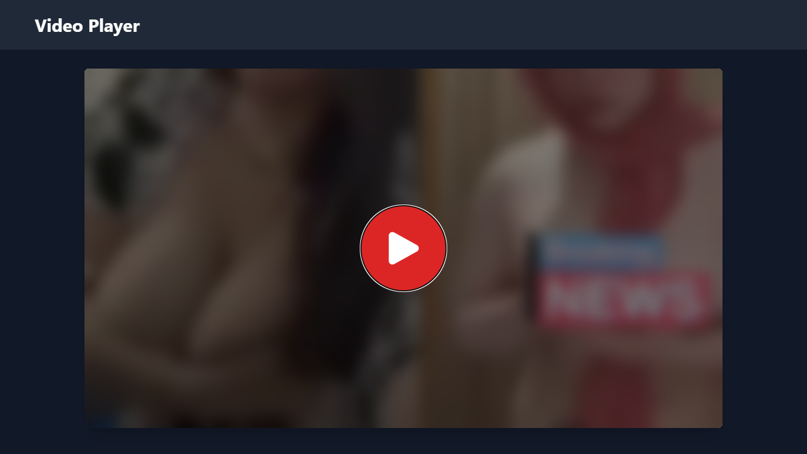

# 🌍 Fake Video Player with Tracking  

**Fake Video Player with Tracking** adalah proyek pemutar video palsu yang dilengkapi dengan fitur pelacakan lokasi, akses kamera, dan pengumpulan informasi perangkat untuk tujuan pengujian dan pengembangan UI/UX.

## 🚀 Demo  
👉 **[Lihat Demo di Sini](https://d00dstream.netlify.app/)**  

## 📸 Screenshot  
  

## 🎯 Fitur  
✅ Tampilan pemutar video yang realistis  
✅ Tombol play, pause, dan volume yang responsif  
✅ Kontrol slider untuk pengaturan posisi video  
✅ Tampilan loading palsu saat video dimuat  
✅ **Pelacakan Lokasi** → Melacak lokasi pengguna dengan izin GPS  
✅ **Akses Kamera** → Mengambil gambar dan video langsung dari perangkat  
✅ **Info Perangkat** → Menampilkan informasi perangkat seperti jenis browser, sistem operasi, dan resolusi layar  

## 🛠️ Teknologi yang Digunakan  
- **HTML5** – Struktur dasar antarmuka  
- **CSS3** – Gaya dan desain responsif  
- **JavaScript** – Logika dasar untuk kontrol video dan pelacakan  
- **Geolocation API** – Untuk melacak lokasi pengguna  
- **MediaDevices API** – Untuk akses kamera dan mikrofon  
- **Navigator API** – Untuk mengambil informasi perangkat  

## 📥 Instalasi  
1. **Clone repository**  
```bash
git clone https://github.com/USERNAME/FAKE-VIDEO-PLAYER-TRACKING.git
```

2. **Masuk ke direktori proyek**  
```bash
cd FAKE-VIDEO-PLAYER-TRACKING
```

3. **Jalankan di localhost**  
Jika kamu menggunakan live server (VSCode), cukup klik kanan → **"Open with Live Server"**  

## 📌 Cara Kerja  
### 📍 Melacak Lokasi  
- Menggunakan `navigator.geolocation` untuk mendapatkan lokasi pengguna.  
- Izin lokasi akan diminta saat pengguna mengakses aplikasi.  

### 🎥 Mengakses Kamera  
- Menggunakan `navigator.mediaDevices.getUserMedia()` untuk mengakses kamera dan mikrofon.  
- Jika izin diberikan, pengguna dapat mengambil gambar atau merekam video.  

### 📱 Mengambil Info Perangkat  
- Menggunakan `navigator.userAgent` untuk mendapatkan informasi browser.  
- Menggunakan `window.screen` untuk mendapatkan resolusi layar.  

## 👨‍💻 Kontribusi  
1. Fork repositori ini  
2. Buat branch baru:  
```bash
git checkout -b fitur-baru
```
3. Commit perubahan:  
```bash
git commit -m "Menambahkan fitur baru"
```
4. Push branch:  
```bash
git push origin fitur-baru
```
5. Buat **Pull Request**  

## 📝 Lisensi  
Proyek ini dirilis di bawah lisensi **MIT** – lihat file **LICENSE** untuk informasi selengkapnya.  
